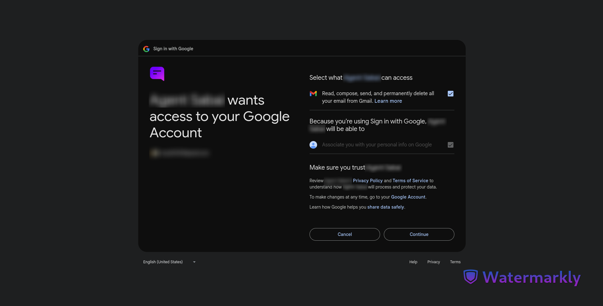

# Easy MCP Gmail Tools

This is a set of tools for gmail to be used with easy mcp server.<br>
https://github.com/ground-creative/easy-mcp-python

## Key Features

- **Drafts**: Create, reply, modify, delete, send, and fetch drafts.
- **Emails**: Send, reply, forward, archive, move, mark as read/unread or spam, and star emails.
- **Labels**: Create, delete, assign, and remove labels.
- **Threads**: View and manage email threads.

## Authentication

This application uses Google's OAuth service to authenticate users.
To use this app, you must create an OAuth 2.0 Client ID in the Google Cloud Console and configure the appropriate scopes for your application.

## Installation

1. Clone the repository from the root folder of the easy mcp installation:

```
git clone https://github.com/ground-creative/easy-mcp-gmail-tools-python.git app
```

2. Install requirements:

```
pip install -r app/requirements.txt
```

3. Generate encryption key:

```
python -c "from cryptography.fernet import Fernet; print(Fernet.generate_key().decode())"
```

4. Add parameters to env file:

```
APP_HOST=http://localhost:8000
DB_PATH=storage/sqlite_credentials.db
CYPHER=Your Encryption Key Here
```

5. Add `client_secrets.json` in storage folder

6. Run the server:

```
# Run via fastapi wrapper
python3 run.py -s fastapi
```

## Available MCP Tools

The following tools are provided by this MCP server:

## Tools and Specifications

| Tool Name          | Description                                                                         | Parameters Required                                                                                          |
| ------------------ | ----------------------------------------------------------------------------------- | ------------------------------------------------------------------------------------------------------------ |
| Create Draft       | Composes and saves an email to the user's draft folder in Gmail.                    | to (str), subject (str), body (str), cc (Optional [str]), bcc (Optional [str]), is_html (Optional [bool])    |
| Create Draft Reply | Composes and saves a reply to an existing email message in the user's draft folder. | message_id (str), body (str), to (Optional [str]), cc (Optional [str]), bcc (Optional [str]), is_html (bool) |

\* Make sure you have granted the appropriate scopes for the application to perform the operations on the drive.

## How to Create a Google OAuth 2.0 Client ID

1. Go to Google Cloud Console:
   https://console.cloud.google.com/

2. Create or Select a Project:

   - Click on the project dropdown at the top.
   - Select an existing project or click "New Project" to create a new one.

3. Enable Required APIs:

   - Navigate to: APIs & Services > Library
   - Search for and enable the following APIs:
     - Google Drive API
     - Google Docs API
     - Google Sheets API (if needed)

4. Configure OAuth Consent Screen:

   - Go to: APIs & Services > OAuth consent screen
   - Choose "External" for public apps, or "Internal" for private use.
   - Fill in the required fields:
     - App name
     - User support email
     - Developer contact info
   - Add necessary scopes:
     - `https://www.googleapis.com/auth/drive`
     - `https://www.googleapis.com/auth/documents`
     - `https://www.googleapis.com/auth/spreadsheets`
     - `openid`
   - Save and continue

5. Create OAuth 2.0 Credentials:

   - Go to: APIs & Services > Credentials
   - Click "Create Credentials" > "OAuth client ID"
   - Choose the type based on your application:
     - Web application
     - Desktop app
     - Other
   - For web apps, add authorized redirect URIs (e.g. `https://your-app.com/auth/callback`)
   - Add authorized JavaScript origins if required

6. Save Your Credentials:
   - After creating, Google will show:
     - Client ID
     - Client Secret
   - Store these securely. You’ll need them in your app to authenticate users.

# Screenshots

Server info page:


Google oAuth page


Google psermission scopes page


User authenticated page

